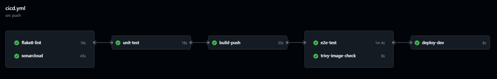

# CI/CD Workflow using GitHub Actions
## _Very simple project to demonstrate GitHub Actions CI/CD with end-to-end testing and deployed on self-hosted runners_

## Workflow Structure

### Workflow Triggers

- **`workflow_dispatch`**: This workflow can be triggered manually from GitHub Actions, though in real life you should use the commented out options for push and pull_request.

### Environment Variables

- **`docker_pass`**: Docker Hub password stored in GitHub secrets.
- **`docker_user`**: Docker Hub username stored in GitHub secrets.
- **`app_name`**: Application image name stored in GitHub variables.

## Detailed Jobs

### 1. avoid_redundancy
**Purpose**: Cancels redundant workflow runs.

**Action Used**: `styfle/cancel-workflow-action@0.12.1`.

### 2. flake8-lint
**Purpose**: Runs code style checks using `flake8`.

**Actions Used**:
- `actions/checkout@v4` to clone the repository.
- `actions/setup-python@v4` to set up Python 3.11.
- `py-actions/flake8@v2` to run `flake8`.

### 3. sonarcloud
**Purpose**: Performs code quality analysis with SonarCloud. You should have an account there (is free), a project and token setup

**Actions Used**:
- `actions/checkout@v4` to clone the repository.
- `sonarsource/sonarcloud-github-action@v3.1.0` to run the scan.

### 4. unit-test
**Purpose**: Runs unit tests to verify basic functionality.

**Dependencies**: Requires successful completion of `flake8-lint` and `sonarcloud`.

**Actions Used**:
- `actions/checkout@v4`.
- `actions/setup-python@v5` with Python 3.12.

**Steps**:
- Install dependencies with `pip`.
- Run unit tests with `unittest`.

### 5. e2e-test
**Purpose**: Runs end-to-end tests using Selenium.

**Dependencies**: Requires successful completion of `flake8-lint` and `sonarcloud`.

**Environment**: Runs on a **`self-hosted`** runner.

**Steps**:
- Install Selenium and pytest.
- Log in to Docker Hub and build the application image.
- Start a Selenium Grid container using `docker-compose`.
- Run the application container and wait for it to be ready.
- Run tests with `pytest`.
- Stop and remove containers and images.

### 6. build-push
**Purpose**: Builds and pushes the application image to Docker Hub.

**Dependencies**: Depends on `unit-test` and `e2e-test`.

**Actions Used**:
- `docker/setup-qemu-action@v3` and `docker/setup-buildx-action@v3` to set up Docker.
- `docker/build-push-action@v6` to build and push the image.

### 7. trivy-image-check
**Purpose**: Runs a vulnerability scan using Trivy.

**Dependencies**: Depends on `build-push`.

**Actions Used**:
- `aquasecurity/trivy-action@0.28.0` to run the vulnerability scan.
- `actions/upload-artifact@v4` to upload the generated report.

### 8. deploy-dev
**Purpose**: Deploys the application image to a development environment.

**Dependencies**: Depends on `trivy-image-check`.

**Steps**:
- Run the application container.
- Verify that the service is ready before completion.

## How to Run the Workflow

1. Ensure that the required secrets and variables are configured in the repository:
   - **`DOCKER_PASS`**
   - **`DOCKER_USERNAME`**
   - **`SONAR_TOKEN`**
   - **`IMAGE_NAME`** (as a variable)

2. Trigger the workflow manually from the GitHub Actions tab.

## Additional Notes
- Make sure that on your self-hosted runner for testing and deployment you have a working docker installation and a docker network **`test_network`** created.
- Please check all the actions at the market place for updates.